# Pipeline de dados na nuvem: incentivos fiscais, pequenos negócios e crescimento econômico no Rio Grande do Sul

MVP da sprint de Engenharia de Dados - pós-graduação em Ciência de Dados (PUC-Rio). 

Plataforma: Databricks Free Edition. 

Autor: Augusto Mozzaquatro Jacques.


O pipeline coleta dados abertos da Receita Estadual do RS, do IBGE, do DEE-RS e uma classificação de cadeias produtivas do Sebrae RS. Foi adotada a organização em arquitetura medalhão e o modelo utilizado na camada final foi o esquema de constelação.

O pipeline também mede a qualidade em cada etapa e responde a cinco das seis perguntas de negócio formuladas. 

A execução é orquestrada por um Job
do Databricks que lê os notebooks deste repositório.

## Sumário

1. [Contexto de Negócios e Perguntas](#1-contexto-de-negócios-e-perguntas)
2. [Carga dos Dados](#2-carga-dos-dados)
3. [Modelagem e Catálogo de Dados](#3-modelagem-e-catálogo-de-dados)
4. [Pipeline de Dados](#4-pipeline-de-dados)
5. [Qualidade de Dados](#5-qualidade-de-dados)
6. [Análise de Dados](#6-análise-de-dados)
7. [Autoavaliação](#7-autoavaliação)
8. [Estrutura do repositório e reprodução](#8-estrutura-do-repositório-e-reprodução)
9. [Referências](#9-referências)

---

## 1. Contexto de Negócios e Perguntas

### 1.1 Problema

O tema vem do trabalho do autor no Núcleo de Dados do Sebrae RS, que apoia a priorização de cadeias produtivas e usa com frequência a pergunta sobre o efeito dos incentivos fiscais.

O Rio Grande do Sul renuncia a R$ 15 a 18 bilhões por ano em benefícios fiscais (total estadual de 2023 a 2025,
segundo a regra da Receita Estadual). Parte relevante é de ICMS e é concedida a atividades específicas, com o objetivo declarado de estimular a economia. Ao mesmo
tempo, instituições de apoio ao desenvolvimento, como o Sebrae RS, priorizam cadeias produtivas e territórios
para suas ações com pequenos negócios.

O problema de negócio é verificar se as **cadeias produtivas e as regiões do RS que recebem mais incentivos
fiscais de ICMS apresentam maior crescimento econômico e maior dinâmica de pequenos negócios**. A resposta orienta a decisão de usar ou não o incentivo fiscal como indicador na priorização de cadeias e territórios pelo Sebrae RS.

O recorte setorial usa as 14 cadeias produtivas prioritárias do Sebrae RS, cada uma definida por um conjunto
de subclasses CNAE. Já o recorte territorial usa os 28 COREDEs (Conselhos Regionais de Desenvolvimento) e os 497
municípios.

### 1.2 Perguntas de negócio

| Pergunta | Janela | Medida principal |
| --- | --- | --- |
| **P1** — Quais cadeias produtivas mais cresceram em arrecadação de ICMS? | 2020–2025 | Crescimento relativo ao ICMS total do RS |
| **P2** — Quais cadeias e COREDEs concentram as desonerações de ICMS, e qual a razão desoneração/arrecadação? | 2020–2025 | Participação e razão sobre o ICMS |
| **P3** — Qual a participação de micro e pequenas empresas (MPE) nas empresas ativas por cadeia e COREDE, e como evoluiu a abertura? | 2020–2025 | Participação do Simples Nacional no estoque |
| **P4** — Cadeias mais desoneradas apresentaram maior saldo de aberturas menos encerramentos? | 2020–2025 | Correlação de Spearman entre intensidade de desoneração e dinâmica empresarial |
| **P5** — Municípios com maior crescimento do PIB per capita apresentam maior dinâmica de pequenos negócios? | 2018–2021 | Correlação de Spearman entre crescimento do PIB per capita e variação do estoque do Simples Nacional |
| **P6** — As cadeias produtivas mais desoneradas ampliaram suas exportações? | — | Fora do escopo do MVP (seção 1.6) |

A janela de cada pergunta é limitada pela cobertura das fontes (ver seção 1.3). Qualquer análise que cruze todas
as fontes cabe apenas em 2020–2023.

### 1.3 Fontes de dados

| Fonte | Conjunto | Período | Formato e acesso | Tabela Bronze |
| --- | --- | --- | --- | --- |
| SEFAZ-RS / Receita Dados | Arrecadação de ICMS por CNAE subclasse | 2015–ago/2026 | CSV, download por script | `icms_cnae_subclasse` |
| SEFAZ-RS / Receita Dados | Arrecadação por município e COREDE (ICMS, IPVA, ITCD) | 2016–ago/2026 | CSV, download por script | `arrecadacao_municipio_corede` |
| SEFAZ-RS / Receita Dados | Desonerações fiscais, série completa | 2016–2025 | CSV, download por script | `desoneracoes` |
| SEFAZ-RS / Receita Dados | Cadastro de contribuintes por setor (CNAE) | 2020–set/2026 | CSV, download por script | `cadastro_contribuintes_setor` |
| SEFAZ-RS / Receita Dados | Cadastro de contribuintes por município | 2015–set/2026 | CSV, download por script | `cadastro_contribuintes_municipio` |
| IBGE | Municípios do RS, com micro e mesorregião | — | JSON, API de Localidades | `ibge_municipios_rs` |
| DEE-RS | PIB e PIB per capita dos municípios, série histórica | 2002–2023 | CSV, carga manual no volume | `dee_pib_municipal_rs` |
| Sebrae RS | Classificação de CNAEs por cadeia produtiva (2026) | 2026 | XLSX, carga manual no volume | `cnae_cadeia_produtiva` |

**Documentos metodológicos da fonte**, publicados no Portal Receita Dados e usados para validar regras e
valores: nota técnica metodológica das desonerações fiscais (11/09/2025), apresentação "Desonerações Fiscais —
Conceito", nota técnica especial sobre os benefícios concedidos após a calamidade de 2024 e nota técnica de
acompanhamento do crédito presumido - biênio 2024–2025.

### 1.4 Estrutura dos dados brutos

A Bronze grava todas as colunas como texto, com os nomes normalizados (minúsculas, sem acento e sem espaço) e
quatro colunas de linhagem: `_ingestao_ts`, `_arquivo_origem`, `_url_origem` e `_fonte`.

| Tabela Bronze | Linhas | Colunas de dados | Conteúdo das colunas |
| --- | ---: | ---: | --- |
| `icms_cnae_subclasse` | 114.243 | 6 | `cod_subclasse`, `nome_subclasse`, `cod_versao` (CNAE 1.1 ou 2.0), `ano`, `mes`, `valor` |
| `arrecadacao_municipio_corede` | 170.392 | 8 | `cod_corede`, `nome_corede`, `cod_munic` (código SEFAZ), `nome_munic`, `sigla_tipo_arr` (tributo), `ano`, `mes`, `valor` |
| `desoneracoes` | 371.900 | 21 | `imposto`, `ano`, `tipo_benef`, `cod_benef`, `descr_benef`, `legislacao_aplicada`, `finalidade`, `justificativa`, `corede`, hierarquia CNAE em cinco níveis (código e descrição), `vlr_desoner`, `qtd_cnpj8` |
| `cadastro_contribuintes_setor` | 192.912 | 13 | `ano`, `mes`, `categoria`, hierarquia CNAE (divisão, grupo, classe, subclasse fiscal, com código e nome no mesmo campo), `atividade`, `area`, `setor`, estabelecimentos ativos, baixados e novos |
| `cadastro_contribuintes_municipio` | 292.779 | 13 | `anomes`, `ano`, `mes`, `cod_categ`, `categoria`, `cod_municipio_ibge`, `municipio_ibge`, `cod_corede`, `corede`, `qtd_ativos`, `qtd_baixados`, `qtd_novos`, data de atualização |
| `ibge_municipios_rs` | 497 | JSON aninhado | `id`, `nome`, `microrregiao` (com `mesorregiao` e `UF` aninhadas), `regiao-imediata` |
| `dee_pib_municipal_rs` | 10.923 | 11 | `ano`, `cod_municipio_ibge`, `nome_municipio`, VAB por setor (agropecuária, indústria, serviços, administração pública, total), `impostos_liquidos`, `pib`, `pib_per_capita` |
| `cnae_cadeia_produtiva` | 1.394 | 3 | `cnae_origem`, `denominacao_cnae`, `cadeia` |

Características da fonte que condicionam o tratamento:

- **Encodings mistos**: os CSV da SEFAZ vêm em UTF-8 (ICMS e desonerações) ou ISO-8859-1 (arrecadação e cadastros).
- **Números em texto no padrão brasileiro**: vírgula decimal e, nas desonerações, ponto de milhar também em ano, código e CNAE.
- **Dois níveis de granularidade nas desonerações**: linhas por dispositivo × COREDE × subclasse e linhas estaduais sem CNAE nem COREDE (Simples Nacional, Simples Gaúcho, IPVA, ITCD).
- **Duas versões da CNAE** convivem no ICMS (1.1 e 2.0), e desde nov/2024 o código residual `0000000` aparece com dois nomes ("SEM CNAE" e "OUTROS").
- **Código de município próprio da SEFAZ** na arrecadação, distinto do código IBGE, e dois códigos residuais (0 "Sem Município" e 900 "Outras UF").
- **Estoque e fluxo**: estabelecimentos ativos são estoque mensal. Novos e baixados são fluxo.
- **PIB per capita** disponível no DEE a partir de 2010.

### 1.5 Licença de uso

| Fonte | Condição de uso |
| --- | --- |
| SEFAZ-RS / Receita Dados | O portal declara os conjuntos como dados abertos, de acesso livre, que "podem ser livremente trabalhados por quem os acessa". Não há licença nomeada; cada conjunto publica data de atualização e ficha técnica. Desde a LC 187/2021, que alterou o art. 198 do CTN, benefícios de pessoa jurídica não estão sob sigilo fiscal: a série de desonerações é publicada sem supressão. |
| IBGE | Dados públicos de órgão oficial, de acesso livre pela API de Localidades, com citação da fonte. |
| DEE-RS | Publicação oficial de acesso livre do Departamento de Economia e Estatística do RS, conveniado do IBGE no cálculo do PIB municipal; uso com citação da fonte. |
| Sebrae RS | Taxonomia institucional que associa subclasses CNAE a cadeias produtivas, sem dados de empresas nem informação sensível. Usada pelo autor, colaborador da instituição, e não redistribuída neste repositório. |

Os dados não são versionados no repositório; o pipeline os obtém nas fontes a cada execução, exceto os dois
arquivos de carga manual (seção 2.3).

### 1.6 Evolução das perguntas e desvios de curso

As perguntas foram fixadas antes da coleta. Ao longo do trabalho, limitações das fontes obrigaram a ajustar
janelas e medidas de cinco delas e a deixar uma fora do escopo. Nenhuma pergunta foi removida.

| Pergunta | Plano inicial | Versão final | Entrave | Consequência |
| --- | --- | --- | --- | --- |
| P1 | Variação nominal do ICMS por cadeia, 2020–2025 | Crescimento relativo ao ICMS do Estado, com repetição a partir de 2021 | Valores nominais misturam crescimento e inflação. Em 2020, a arrecadação foi deprimida pela pandemia. | Medida neutra ao nível de preços. O teste com base 2021 mostrou que o ganho de Metalmecânico e Casa e Construção é recuperação |
| P2 | Desonerações de 2021 a 2024 | Desonerações de 2020 a 2025 | A base inicial eram os demonstrativos anuais (2021–2023 e 2024), com o não estorno do crédito como estimativa global | Adoção da série completa de 2016–2025, mais recente e detalhada por dispositivo, CNAE e COREDE |
| P3 | MPE = Simples Nacional + MEI | MPE = Simples Nacional | O MEI só é publicado desde set/2024, com baixas acumuladas contrariando o dicionário da fonte | MEI fora do universo. A exclusão do Simples Nacional em jan/2024, identificada na análise, passou a ser declarada ao lado da participação |
| P4 | Saldo de aberturas menos baixas, 2021–2024 | Variação do estoque (principal) e saldo, 2020–2025; correlação repetida sem as cadeias com ressalva | Janela da desoneração (ver P2); os fluxos incluem migração entre categorias e não registram a exclusão de jan/2024; as duas cadeias de maior intensidade têm ressalva | Estoque como medida de referência; resultado lido como ausência de evidência |
| P5 | Taxa de abertura de pequenos negócios, 2020–2023 | Variação do estoque do Simples Nacional, dez/2018–dez/2021 | Fluxos do cadastro por município incompletos a partir de 2021; quebra da população com o Censo 2022; exclusão do Simples Nacional refletida no estoque de dez/2023 | Medida trocada por estoque; janela alinhada ao crescimento do PIB per capita dentro da mesma base populacional |
| P6 | Desoneração das exportações e desempenho exportador das cadeias | Não respondida | Exigiria uma nova fonte (Comex Stat) e a correspondência entre a classificação de mercadorias (NCM) e a CNAE; a desoneração de exportação é de competência federal e não integra o total do Estado | Entendeu-se que a pergunta excedia o escopo do MVP; fica como oportunidade de análise futura |

Duas mudanças de fonte acompanharam esses ajustes. O cadastro CNPJ da Receita Federal, previsto para dar granularidade de CNAE por município, foi descartado porque o servidor recusou conexão a partir do Databricks. O cadastro de contribuintes da SEFAZ-RS cobre abertura, baixa e regime tributário. O PIB municipal passou do IBGE para o DEE-RS, que publica o mesmo cálculo em reais e com o per capita coerente (seção 2.3).

---

## 2. Carga dos Dados

A carga é feita por scripts, sem upload manual pela interface, exceto em dois arquivos: a série do DEE-RS, sem URL estável de download, e a planilha do Sebrae RS, que não é publicada. Os notebooks estão em  `notebooks/`.

### 2.1 Teste de acesso às fontes — [`01_teste_acesso_fontes`](notebooks/01_teste_acesso_fontes.ipynb)

Antes da ingestão, cada fonte candidata foi testada a partir do Databricks Free Edition. O resultado definiu o
escopo de coleta:

| Fonte | Resultado | Decisão |
| --- | --- | --- |
| SEFAZ-RS / Receita Dados | HTTP 200 | Adotada |
| IBGE — API de Localidades | HTTP 200 | Adotada |
| IBGE — SIDRA (PIB municipal) | HTTP 403 (proteção anti-robô) | Substituída pelo DEE-RS (seção 2.3) |
| Receita Federal — CNPJ | Conexão recusada pelo servidor | Descartada; o cadastro da SEFAZ cobre abertura, baixa e regime |
| Comex Stat | Acesso só com `verify=False` | Fora do escopo do MVP: P6 não respondida (seção 1.6) |
| RAIS | HTTP 404 | Descartada |

Os servidores de governo usam cadeia ICP-Brasil. `verify=False` é aplicado apenas a downloads públicos.

### 2.2 Catálogo, schemas e volume — [`00_setup_catalogo`](notebooks/00_setup_catalogo.ipynb)

Cria o catálogo `mvp_pipeline_vf` no Unity Catalog, os schemas `bronze`, `silver` e `gold` e o volume
`bronze.arquivos_brutos`, onde ficam os arquivos originais.


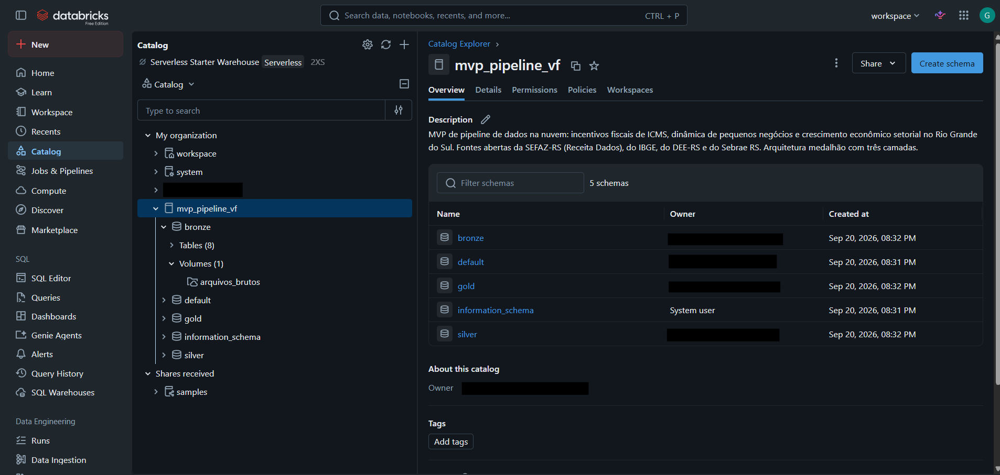

### 2.3 Ingestão na Bronze — [`02_bronze`](notebooks/02_bronze.ipynb)

| Etapa | O que faz | Por quê |
| --- | --- | --- |
| Download | Baixa os cinco CSV da SEFAZ para `/Volumes/mvp_pipeline_vf/bronze/arquivos_brutos/sefaz/` | Guarda o arquivo original para reprocessamento e auditoria |
| Interrupção por falha | Se algum download falhar, a execução para | Evita regravar arquivo antigo com data de ingestão nova |
| Detecção de encoding e separador | Lê o início de cada arquivo e testa UTF-8 antes de ISO-8859-1 | Encodings mistos na mesma fonte |
| Leitura | Spark, `header=True`, `inferSchema=False` | Todo o conteúdo entra como texto: nenhuma conversão na Bronze |
| Nomes de coluna | Remove acento, espaço, BOM e caracteres recusados pelo Delta | `CNAE Divisão` → `cnae_divisao` |
| Linhagem | Acrescenta `_ingestao_ts`, `_arquivo_origem`, `_url_origem`, `_fonte` | Rastrear cada linha até o arquivo e a data de coleta |
| Gravação | Tabela Delta, `mode("overwrite")` | Carga completa |

Fontes de fora da SEFAZ:

- **IBGE**: requisição à API de Localidades, o JSON é salvo no volume e lido pelo Spark.
- **DEE-RS**: o portal não expõe URL estável do arquivo. O CSV da série histórica é carregado manualmente no
  volume (`deers/`) e lido pelo notebook, que descarta as linhas de título e nota do arquivo.
- **Sebrae RS**: a planilha é carregada manualmente no volume (`cadeias/`) e lida com `pandas` (`dtype=str`).

O PIB municipal foi coletado primeiro pela API de Agregados do IBGE e comparado município a município com a série do DEE: diferença de cerca de 5 partes por bilhão, explicada pela unidade de publicação (IBGE em mil reais, DEE em reais). Adotou-se o DEE como fonte única, pela precisão e porque PIB, PIB per capita e população vêm do mesmo cálculo.

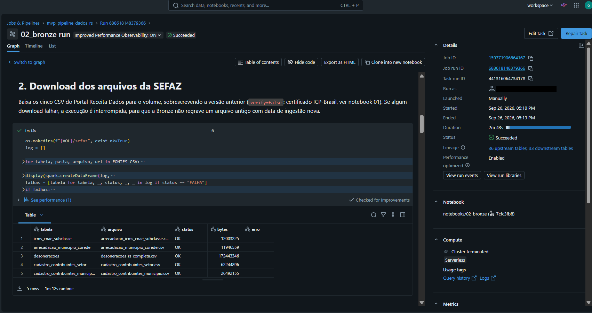

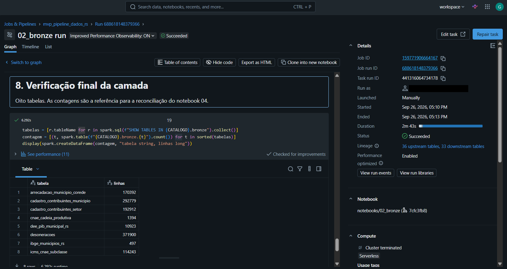

---

## 3. Modelagem e Catálogo de Dados

### 3.1 Arquitetura

| Camada | Papel | Regra |
| --- | --- | --- |
| Bronze | Dado como veio da fonte | Tudo em texto; só nomes de coluna normalizados e linhagem acrescentada |
| Silver | Dado limpo e padronizado | Corrige defeito técnico (tipo, formato, encoding, chave) e marca características da fonte; não aplica regra de negócio |
| Gold | Dado pronto para consumo | Modelo dimensional; regras de negócio como colunas marcadoras, sem exclusão de linha |

### 3.2 Modelo dimensional

A Gold é um **esquema de constelação**: sete fatos de grãos diferentes compartilham seis dimensões. Um esquema
estrela único exigiria agregar todos os fatos ao menor denominador comum (ano × COREDE), perdendo o grão mensal
do ICMS e do cadastro e o grão municipal do PIB.

   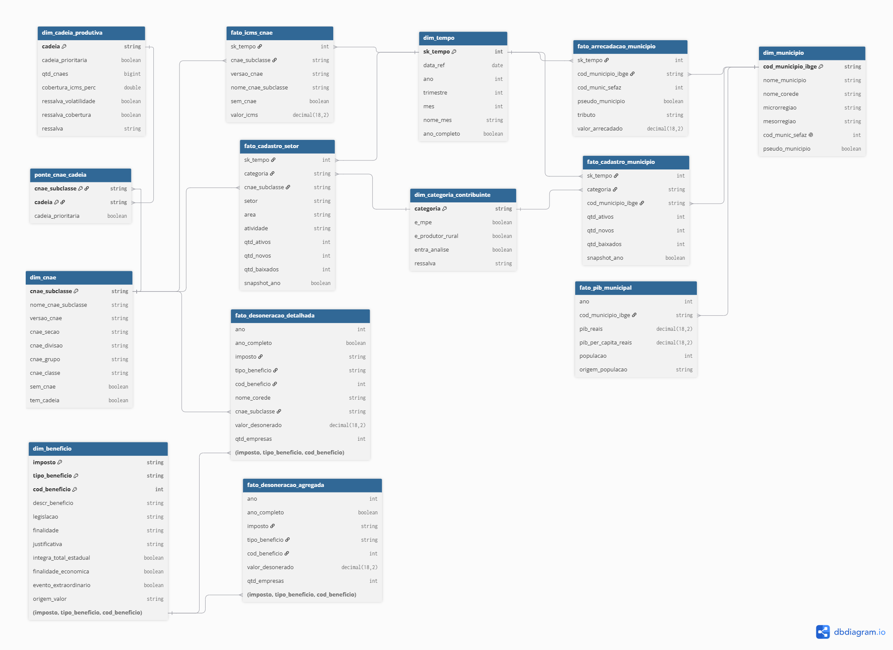

| Objeto | Grão | Linhas |
| --- | --- | ---: |
| `dim_tempo` | mês, 2015–2026 | 144 |
| `dim_cnae` | subclasse CNAE | 1.449 |
| `dim_cadeia_produtiva` | cadeia (14 prioritárias + "Outros") | 15 |
| `ponte_cnae_cadeia` | par subclasse × cadeia | 1.394 |
| `dim_municipio` | município (497) + 2 códigos residuais da SEFAZ | 499 |
| `dim_beneficio` | dispositivo legal (imposto + tipo + código) | 581 |
| `dim_categoria_contribuinte` | categoria do cadastro | 5 |
| `fato_icms_cnae` | mês × versão CNAE × subclasse × nome | 114.243 |
| `fato_arrecadacao_municipio` | mês × município × tributo | 170.392 |
| `fato_desoneracao_detalhada` | ano × dispositivo × COREDE × subclasse | 371.420 |
| `fato_desoneracao_agregada` | ano × dispositivo | 480 |
| `fato_cadastro_setor` | mês × categoria × subclasse | 192.912 |
| `fato_cadastro_municipio` | mês × categoria × município | 292.779 |
| `fato_pib_municipal` | ano × município, 2018–2023 | 2.982 |

**Decisões de modelagem**

| Decisão | Motivo |
| --- | --- |
| Regras de negócio como colunas booleanas nas dimensões (`integra_total_estadual`, `finalidade_economica`, `evento_extraordinario`, `ano_completo`, `entra_analise`), sem filtro na carga | O total publicado pela SEFAZ continua reproduzível a partir da Gold; cada análise escolhe seu recorte |
| Ponte N:N entre CNAE e cadeia | 36 subclasses pertencem a duas cadeias prioritárias; somar cadeias superestima o total em 3,02% no ICMS e em cerca de 29% na desoneração |
| Ressalvas como atributos da dimensão de cadeia (`ressalva_volatilidade`, `ressalva_cobertura`) | Cadeias com menos de cinco subclasses ou cobertura de ICMS abaixo de 70% levam a ressalva a toda consulta |
| Dois fatos de desoneração | A fonte publica dois níveis de granularidade; o nível estadual não tem CNAE nem COREDE. Os fatos são complementares: o total da base soma os dois |
| COREDE como atributo de `dim_municipio` | Uma única fonte de verdade territorial; resolve a inconsistência de COREDE da própria arrecadação. Na desoneração detalhada, publicada por COREDE e não por município, o COREDE fica no fato |
| Chaves naturais, exceto `sk_tempo` (AAAAMM) | As chaves da fonte são estáveis e legíveis; a chave de benefício é composta porque o código só é único dentro de imposto e tipo |
| `origem_valor` na dimensão de benefício | Só o crédito presumido é declarado pelo contribuinte; os demais tipos são estimativa da Receita Estadual |

### 3.3 Catálogo de dados

O catálogo é mantido no Unity Catalog pelo notebook [`06_catalogo`](notebooks/06_catalogo.ipynb): comentário
no catálogo, nos schemas, em cada tabela (grão, período, chaves, origem e ressalvas) e em cada uma das 119
colunas da Gold (significado, domínio e limitações). O dicionário abaixo foi extraído do `information_schema`
pelo próprio notebook. A linhagem entre tabelas é registrada pelo Unity Catalog.

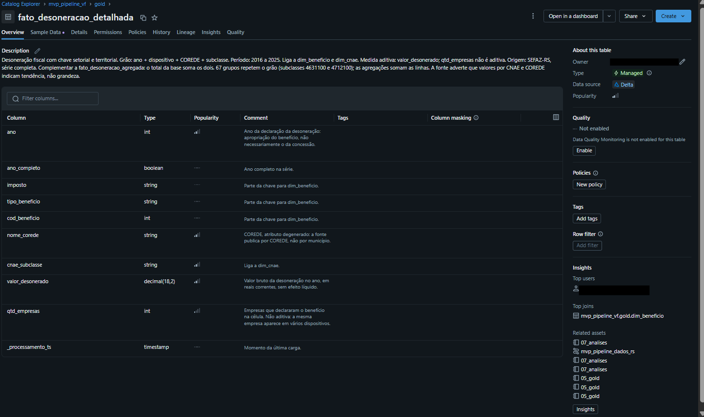

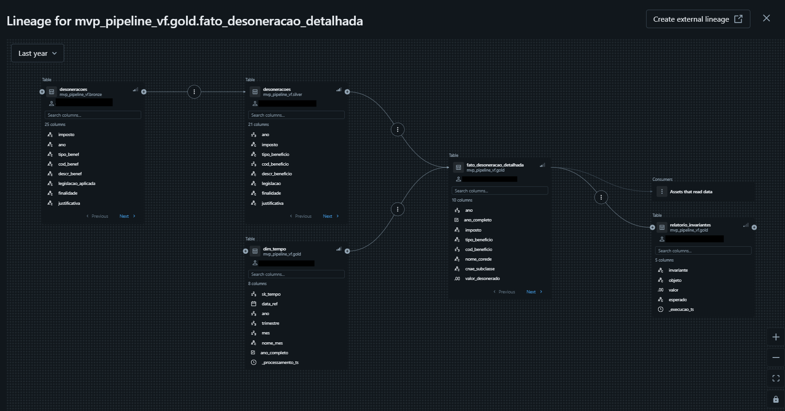

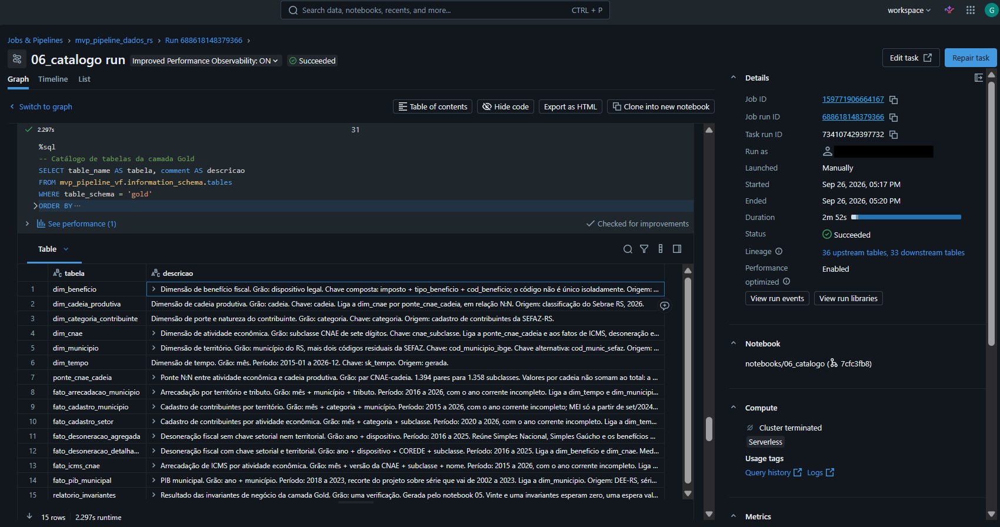

**Domínio das colunas categóricas e numéricas principais**

| Coluna | Domínio |
| --- | --- |
| `sk_tempo` | 201501 a 202612 (AAAAMM); `ano_completo` falso só em 2026 |
| `dim_beneficio.imposto`, `fato_arrecadacao_municipio.tributo` | ICMS, IPVA, ITCD |
| `dim_beneficio.tipo_beneficio` | ALIQUOTA ZERO, BASE DE CALCULO REDUZIDA, CREDITO PRESUMIDO, DESCONTO, IMUNIDADE, ISENCAO, NAO ESTORNO DE CREDITO, NAO INCIDENCIA, REGIME DIFERENCIADO DE APURACAO, SIMPLES GAUCHO, SIMPLES NACIONAL |
| `dim_beneficio.finalidade` | AGROPECUARIO, ALIMENTACAO (SOCIAL), ASSISTENCIA SOCIAL, CULTURAL (SOCIAL), ECOLOGICO, ECONOMICO, EXPORTACOES, MICROEMPRESAS E EPPS, OPERACIONAL, SAUDE (SOCIAL), SETOR PUBLICO |
| `dim_beneficio.origem_valor` | DIRETO (crédito presumido), ESTIMATIVA |
| `dim_categoria_contribuinte.categoria` | GERAL, MEI, MICROPRODUTOR, PRODUTOR, SIMPLES NACIONAL; nula em 46 linhas de `fato_cadastro_municipio` |
| `dim_cadeia_produtiva.cadeia` | Alimentos e Bebidas, Apicultura, Casa e Construção, Grão Integrados, Horticultura, Leite, Metalmecânico, Moda, Móveis, Olivicultura, Pecuária, Saúde, Turismo, Vitivinicultura; Outros (não priorizado) |
| `dim_cadeia_produtiva.qtd_cnaes` | 1 a 149 nas prioritárias; 678 em "Outros" |
| `dim_cadeia_produtiva.cobertura_icms_perc` | 33,8 a 100,0 nas cadeias prioritárias |
| `dim_cnae.versao_cnae` | 1.1, 2.0 |
| `dim_municipio.nome_corede` | 28 COREDEs; nulo nos 2 pseudomunicípios |
| `fato_pib_municipal.origem_populacao` | Estimativa IBGE (2018–2021), Censo 2022 (2022–2023) |

| Coluna numérica | Mínimo | Máximo | Observação |
| --- | ---: | ---: | --- |
| `fato_icms_cnae.valor_icms` | −6.745.222,03 | 1.260.637.876,41 | R$ por mês e subclasse; negativo em 16 linhas (restituição e compensação) |
| `fato_arrecadacao_municipio.valor_arrecadado` | −922.532,23 | 1.412.952.899,82 | R$ por mês, município e tributo; negativo por restituição e compensação |
| `fato_desoneracao_detalhada.valor_desonerado` | 0,00 | 1.387.571.736,00 | R$ por ano e célula; zero quando publicado assim pela fonte |
| `fato_desoneracao_detalhada.qtd_empresas` | 1 | 412 | Empresas por célula; não aditiva |
| `fato_desoneracao_agregada.valor_desonerado` | 0,00 | 1.558.727.417,00 | R$ por ano e dispositivo estadual |
| `fato_cadastro_setor.qtd_ativos` | 0 | 191.630 | Estabelecimentos por mês, categoria e subclasse |
| `fato_cadastro_municipio.qtd_ativos` | 0 | 51.860 | Estabelecimentos por mês, categoria e município |
| `fato_pib_municipal.pib_reais` | 31.554.691 | 104.743.272.125 | R$ correntes; máximo: Porto Alegre, 2023 |
| `fato_pib_municipal.pib_per_capita_reais` | 12.934 | 430.465 | R$ correntes por habitante |
| `fato_pib_municipal.populacao` | 932 | 1.492.517 | Habitantes; máximo: Porto Alegre, 2021 (estimativa IBGE) |

**Dicionário de dados da camada Gold** (clique para expandir cada tabela)

<details>
<summary><code>gold.dim_tempo</code> — 144 linhas</summary>

Dimensão de tempo. Grão: mês. Período: 2015-01 a 2026-12. Chave: sk_tempo. Origem: gerada.

**Linhagem:** Gerada no notebook 05; `ano_completo` derivado de `silver.icms_cnae_subclasse`.

| Coluna | Tipo | Descrição |
| --- | --- | --- |
| `sk_tempo` | int | Chave da dimensão, formato AAAAMM. |
| `data_ref` | date | Primeiro dia do mês. |
| `ano` | int | Ano civil. |
| `trimestre` | int | Trimestre civil, 1 a 4. |
| `mes` | int | Mês civil, 1 a 12. |
| `nome_mes` | string | Nome do mês por extenso. |
| `ano_completo` | boolean | Ano com doze meses na série. Filtro padrão de comparação anual. |
| `_processamento_ts` | timestamp | Momento da última carga. |

</details>

<details>
<summary><code>gold.dim_cnae</code> — 1.449 linhas</summary>

Dimensão de atividade econômica. Grão: subclasse CNAE de sete dígitos. Chave: cnae_subclasse. Liga a ponte_cnae_cadeia e aos fatos de ICMS, desoneração e cadastro. Origem: códigos presentes em quatro fontes.

**Linhagem:** Códigos de `silver.icms_cnae_subclasse`, `silver.desoneracoes`, `silver.cadastro_setor` e `silver.cnae_cadeia`; nome do ICMS ou, na falta, do Sebrae; hierarquia das desonerações.

| Coluna | Tipo | Descrição |
| --- | --- | --- |
| `cnae_subclasse` | string | Código CNAE de subclasse, sete dígitos. |
| `nome_cnae_subclasse` | string | Denominação da subclasse. |
| `versao_cnae` | string | Versão da classificação: 1.1 ou 2.0. |
| `cnae_secao` | string | Seção da CNAE. Nula fora das desonerações. |
| `cnae_divisao` | string | Divisão da CNAE, dois dígitos. |
| `cnae_grupo` | string | Grupo da CNAE, três dígitos. |
| `cnae_classe` | string | Classe da CNAE, cinco dígitos. |
| `sem_cnae` | boolean | Código residual 0000000, sem atividade atribuída. Responde por 4,16% do ICMS. |
| `tem_cadeia` | boolean | Código com correspondência no de-para do Sebrae RS. Falso em 91 subclasses, incluindo o residual 0000000. |
| `_processamento_ts` | timestamp | Momento da última carga. |

</details>

<details>
<summary><code>gold.dim_cadeia_produtiva</code> — 15 linhas</summary>

Dimensão de cadeia produtiva. Grão: cadeia. Chave: cadeia. Liga a dim_cnae por ponte_cnae_cadeia, em relação N:N. Origem: classificação do Sebrae RS, 2026.

**Linhagem:** `silver.cnae_cadeia` (planilha do Sebrae RS); cobertura calculada contra `silver.icms_cnae_subclasse` de 2024.

| Coluna | Tipo | Descrição |
| --- | --- | --- |
| `cadeia` | string | Nome da cadeia. Catorze prioritárias mais "Outros (não priorizado)". |
| `cadeia_prioritaria` | boolean | Cadeia priorizada pelo Sebrae RS. |
| `qtd_cnaes` | bigint | Subclasses que compõem a cadeia: de 1 a 149 nas prioritárias; 678 em "Outros (não priorizado)". |
| `cobertura_icms_perc` | double | Percentual das subclasses da cadeia com ICMS em 2024. |
| `ressalva_volatilidade` | boolean | Cadeia com menos de cinco subclasses. |
| `ressalva_cobertura` | boolean | Cobertura de ICMS abaixo de 70%. |
| `ressalva` | string | Texto da ressalva, para exibir junto do resultado. Nulo quando não há. |
| `_processamento_ts` | timestamp | Momento da última carga. |

</details>

<details>
<summary><code>gold.ponte_cnae_cadeia</code> — 1.394 linhas</summary>

Ponte N:N entre atividade econômica e cadeia produtiva. Grão: par CNAE-cadeia. 1.394 pares para 1.358 subclasses. Valores por cadeia não somam ao total: a soma supera o total em 3,02% no ICMS e em cerca de 29% na desoneração.

**Linhagem:** `silver.cnae_cadeia` ← `bronze.cnae_cadeia_produtiva` ← planilha do Sebrae RS.

| Coluna | Tipo | Descrição |
| --- | --- | --- |
| `cnae_subclasse` | string | Liga a dim_cnae e aos fatos. |
| `cadeia` | string | Liga a dim_cadeia_produtiva. |
| `cadeia_prioritaria` | boolean | Repetido da dimensão, para filtro sem junção. |
| `_processamento_ts` | timestamp | Momento da última carga. |

</details>

<details>
<summary><code>gold.dim_municipio</code> — 499 linhas</summary>

Dimensão de território. Grão: município do RS, mais dois códigos residuais da SEFAZ. Chave: cod_municipio_ibge. Chave alternativa: cod_munic_sefaz. Origem: IBGE, com COREDE do cadastro da SEFAZ-RS. O COREDE vem desta dimensão nos fatos de arrecadação, cadastro e PIB; na desoneração detalhada é atributo do próprio fato.

**Linhagem:** `silver.municipio_ibge` (API IBGE) + COREDE de `silver.cadastro_municipio` + código SEFAZ de `silver.depara_municipio`.

| Coluna | Tipo | Descrição |
| --- | --- | --- |
| `cod_municipio_ibge` | string | Código IBGE, sete dígitos. Nulo nos pseudomunicípios. |
| `nome_municipio` | string | Nome do município. |
| `nome_corede` | string | Conselho Regional de Desenvolvimento, recorte territorial oficial do RS. |
| `microrregiao` | string | Microrregião do IBGE. |
| `mesorregiao` | string | Mesorregião do IBGE. |
| `cod_munic_sefaz` | int | Código próprio da SEFAZ-RS, distinto do IBGE. Resolvido por de-para na Silver. |
| `pseudo_municipio` | boolean | Códigos residuais 0 (Sem Município) e 900 (Outras UF). Nunca entram em análise territorial. |
| `_processamento_ts` | timestamp | Momento da última carga. |

</details>

<details>
<summary><code>gold.dim_beneficio</code> — 581 linhas</summary>

Dimensão de benefício fiscal. Grão: dispositivo legal. Chave composta: imposto + tipo_beneficio + cod_beneficio; o código não é único isoladamente. Origem: série completa de desonerações da SEFAZ-RS, 2016 a 2025.

**Linhagem:** `silver.desoneracoes`, agrupada por imposto, tipo e código.

| Coluna | Tipo | Descrição |
| --- | --- | --- |
| `imposto` | string | ICMS, IPVA ou ITCD. |
| `tipo_beneficio` | string | Natureza jurídica do benefício. Onze valores, sem acento. |
| `cod_beneficio` | int | Código do dispositivo, sequencial dentro de imposto e tipo. |
| `descr_beneficio` | string | Descrição do dispositivo. |
| `legislacao` | string | Artigo e inciso do regulamento do imposto. |
| `finalidade` | string | Objetivo da concessão, classificado pela fonte. Onze valores, sem acento. |
| `justificativa` | string | Justificativa da concessão. |
| `integra_total_estadual` | boolean | Benefício que entra no total do Estado. Falso para imunidade, não incidência e não estorno do crédito, conforme quadro-resumo da nota técnica. |
| `finalidade_economica` | boolean | Benefício de finalidade econômica. Filtro obrigatório do recorte setorial. |
| `evento_extraordinario` | boolean | Dispositivo criado após a calamidade de 2024. Cinco casos: R$ 90,8 milhões em 2024; a isenção 194 segue em 2025. |
| `origem_valor` | string | DIRETO quando declarado pelo contribuinte, caso do crédito presumido; ESTIMATIVA nos demais. |
| `_processamento_ts` | timestamp | Momento da última carga. |

</details>

<details>
<summary><code>gold.dim_categoria_contribuinte</code> — 5 linhas</summary>

Dimensão de porte e natureza do contribuinte. Grão: categoria. Chave: categoria. Origem: cadastro de contribuintes da SEFAZ-RS.

**Linhagem:** Categorias distintas de `silver.cadastro_setor`.

| Coluna | Tipo | Descrição |
| --- | --- | --- |
| `categoria` | string | MEI, SIMPLES NACIONAL, GERAL, MICROPRODUTOR ou PRODUTOR. |
| `e_mpe` | boolean | Micro ou pequena empresa: MEI e Simples Nacional. |
| `e_produtor_rural` | boolean | Produtor rural, nunca somado às empresas. |
| `entra_analise` | boolean | Falso para MEI: série publicada só desde set/2024 e com baixas acumuladas. |
| `ressalva` | string | Limitação da categoria: MEI com série não comparável; Simples Nacional e Geral com migração de jan/2024 sem registro no fluxo. Nulo quando não há. |
| `_processamento_ts` | timestamp | Momento da última carga. |

</details>

<details>
<summary><code>gold.fato_icms_cnae</code> — 114.243 linhas</summary>

Arrecadação de ICMS por atividade econômica. Grão: mês + versão da CNAE + subclasse + nome. Período: 2015 a 2026, com o ano corrente incompleto. Liga a dim_tempo e dim_cnae. Medida aditiva: valor_icms. Origem: SEFAZ-RS.

**Linhagem:** `silver.icms_cnae_subclasse` ← `bronze.icms_cnae_subclasse` ← CSV da SEFAZ-RS.

| Coluna | Tipo | Descrição |
| --- | --- | --- |
| `sk_tempo` | int | Liga a dim_tempo. |
| `cnae_subclasse` | string | Liga a dim_cnae. |
| `versao_cnae` | string | Compõe o grão: a fonte publica CNAE 1.1 e 2.0 lado a lado. |
| `nome_cnae_subclasse` | string | Compõe o grão: desde nov/2024 há duas categorias residuais sob o código 0000000. |
| `sem_cnae` | boolean | Linha sem atividade econômica atribuída. |
| `valor_icms` | decimal(18,2) | Arrecadação líquida no mês, em reais correntes. Negativa em 16 linhas, por restituição e compensação. |
| `_processamento_ts` | timestamp | Momento da última carga. |

</details>

<details>
<summary><code>gold.fato_arrecadacao_municipio</code> — 170.392 linhas</summary>

Arrecadação por território e tributo. Grão: mês + município + tributo. Período: 2016 a 2026, com o ano corrente incompleto. Liga a dim_tempo e dim_municipio. Medida aditiva: valor_arrecadado. Origem: SEFAZ-RS. A série de ICMS coincide com fato_icms_cnae: são cortes do mesmo agregado. Um caso repete o grão: Porto Alegre, IPVA, jul/2025, com linha SEM COREDE de R$ 890,10.

**Linhagem:** `silver.arrecadacao_municipio` + `silver.depara_municipio` (código IBGE) ← `bronze.arrecadacao_municipio_corede`.

| Coluna | Tipo | Descrição |
| --- | --- | --- |
| `sk_tempo` | int | Liga a dim_tempo. |
| `cod_municipio_ibge` | string | Liga a dim_municipio. Nulo nos pseudomunicípios. |
| `cod_munic_sefaz` | int | Código original da SEFAZ-RS, mantido para rastreabilidade. |
| `pseudo_municipio` | boolean | Códigos residuais 0 e 900. |
| `tributo` | string | ICMS, IPVA ou ITCD. |
| `valor_arrecadado` | decimal(18,2) | Arrecadação líquida no mês, em reais correntes. |
| `_processamento_ts` | timestamp | Momento da última carga. |

</details>

<details>
<summary><code>gold.fato_desoneracao_detalhada</code> — 371.420 linhas</summary>

Desoneração fiscal com chave setorial e territorial. Grão: ano + dispositivo + COREDE + subclasse. Período: 2016 a 2025. Liga a dim_beneficio e dim_cnae. Medida aditiva: valor_desonerado; qtd_empresas não é aditiva. Origem: SEFAZ-RS, série completa. Complementar a fato_desoneracao_agregada: o total da base soma os dois. 67 grupos repetem o grão (subclasses 4631100 e 4712100); as agregações somam as linhas.

**Linhagem:** `silver.desoneracoes` com `nivel_agregacao = DETALHADO` + `ano_completo` da `dim_tempo` ← `bronze.desoneracoes`.

| Coluna | Tipo | Descrição |
| --- | --- | --- |
| `ano` | int | Ano da declaração da desoneração. |
| `ano_completo` | boolean | Ano completo na série. |
| `imposto` | string | Parte da chave para dim_beneficio. |
| `tipo_beneficio` | string | Parte da chave para dim_beneficio. |
| `cod_beneficio` | int | Parte da chave para dim_beneficio. |
| `nome_corede` | string | COREDE |
| `cnae_subclasse` | string | Liga a dim_cnae. |
| `valor_desonerado` | decimal(18,2) | Valor bruto da desoneração no ano, em reais correntes, sem efeito líquido. |
| `qtd_empresas` | int | Empresas que declararam o benefício na célula. Não aditiva: a mesma empresa aparece em vários dispositivos. |
| `_processamento_ts` | timestamp | Momento da última carga. |

</details>

<details>
<summary><code>gold.fato_desoneracao_agregada</code> — 480 linhas</summary>

Desoneração fiscal sem chave setorial nem territorial. Grão: ano + dispositivo. Período: 2016 a 2025. Reúne Simples Nacional, Simples Gaúcho e os benefícios de IPVA e ITCD, que a fonte publica sem CNAE nem COREDE. Complementar a fato_desoneracao_detalhada: o total da base soma os dois.

**Linhagem:** `silver.desoneracoes` com `nivel_agregacao = AGREGADO_ESTADUAL` ← `bronze.desoneracoes`.

| Coluna | Tipo | Descrição |
| --- | --- | --- |
| `ano` | int | Ano da declaração da desoneração. |
| `ano_completo` | boolean | Ano completo na série. |
| `imposto` | string | Parte da chave para dim_beneficio. |
| `tipo_beneficio` | string | Parte da chave para dim_beneficio. |
| `cod_beneficio` | int | Parte da chave para dim_beneficio. |
| `valor_desonerado` | decimal(18,2) | Valor bruto estimado no ano, em reais correntes. |
| `qtd_empresas` | int | Empresas que declararam o benefício. Não aditiva. |
| `_processamento_ts` | timestamp | Momento da última carga. |

</details>

<details>
<summary><code>gold.fato_cadastro_setor</code> — 192.912 linhas</summary>

Cadastro de contribuintes por atividade econômica. Grão: mês + categoria + subclasse. Período: 2020 a 2026, com o ano corrente incompleto. Liga a dim_tempo, dim_categoria_contribuinte e dim_cnae. qtd_ativos é estoque; qtd_novos e qtd_baixados são fluxo. Origem: SEFAZ-RS.

**Linhagem:** `silver.cadastro_setor` ← `bronze.cadastro_contribuintes_setor`.

| Coluna | Tipo | Descrição |
| --- | --- | --- |
| `sk_tempo` | int | Liga a dim_tempo. |
| `categoria` | string | Liga a dim_categoria_contribuinte. |
| `cnae_subclasse` | string | Liga a dim_cnae. |
| `setor` | string | Setor econômico, classificação da SEFAZ-RS. |
| `area` | string | Área de atividade, classificação da SEFAZ-RS. |
| `atividade` | string | Atividade, classificação da SEFAZ-RS. |
| `qtd_ativos` | int | Estoque de estabelecimentos ativos. Não aditivo no tempo. |
| `qtd_novos` | int | Fluxo de aberturas no mês. Inclui migração entre categorias e setores, mas não a exclusão do Simples Nacional de jan/2024. |
| `qtd_baixados` | int | Fluxo de baixas no mês. No MEI vem acumulado, contrariando o dicionário da fonte. |
| `snapshot_ano` | boolean | Último mês publicado do ano. Marca a fotografia anual do estoque. |
| `_processamento_ts` | timestamp | Momento da última carga. |

</details>

<details>
<summary><code>gold.fato_cadastro_municipio</code> — 292.779 linhas</summary>

Cadastro de contribuintes por território. Grão: mês + categoria + município. Período: 2015 a 2026, com o ano corrente incompleto; MEI só a partir de set/2024. qtd_ativos é estoque e coincide com o fato por atividade em cerca de 3%; os fluxos estão incompletos a partir de 2021. 46 linhas sem categoria na fonte. Origem: SEFAZ-RS.

**Linhagem:** `silver.cadastro_municipio` ← `bronze.cadastro_contribuintes_municipio`.

| Coluna | Tipo | Descrição |
| --- | --- | --- |
| `sk_tempo` | int | Liga a dim_tempo. |
| `categoria` | string | Liga a dim_categoria_contribuinte. Nula em 46 linhas. |
| `cod_municipio_ibge` | string | Liga a dim_municipio. |
| `qtd_ativos` | int | Estoque de estabelecimentos ativos. |
| `qtd_novos` | int | Fluxo de aberturas no mês. Incompleto a partir de 2021: usar o estoque. |
| `qtd_baixados` | int | Fluxo de baixas no mês. Incompleto a partir de 2021: usar o estoque. |
| `snapshot_ano` | boolean | Último mês publicado do ano. |
| `_processamento_ts` | timestamp | Momento da última carga. |

</details>

<details>
<summary><code>gold.fato_pib_municipal</code> — 2.982 linhas</summary>

PIB municipal. Grão: ano + município. Período: 2018 a 2023, recorte do projeto sobre série que vai de 2002 a 2023. Liga a dim_municipio. Origem: DEE-RS, série histórica municipal, apuração em convênio com o IBGE. Valores a preços correntes: não medem crescimento real.

**Linhagem:** `silver.pib_municipal` ← `bronze.dee_pib_municipal_rs` ← CSV do DEE-RS; `populacao` derivada.

| Coluna | Tipo | Descrição |
| --- | --- | --- |
| `ano` | int | Ano de referência. |
| `cod_municipio_ibge` | string | Liga a dim_municipio. |
| `pib_reais` | decimal(18,2) | PIB a preços correntes, em reais. Dividido por populacao devolve pib_per_capita_reais. |
| `pib_per_capita_reais` | decimal(18,2) | PIB per capita a preços correntes, em reais, conforme publicado. Base da P5. |
| `populacao` | int | População derivada da razão entre PIB e PIB per capita. Não é coletada: é o denominador que a fonte usou. Erro de arredondamento da ordem de uma pessoa. |
| `origem_populacao` | string | Estimativa IBGE até 2021, Censo 2022 de 2022 em diante. Marca a quebra da série: a variação 2021-2022 mistura crescimento do PIB com recontagem populacional. |
| `_processamento_ts` | timestamp | Momento da última carga. |

</details>

<details>
<summary><code>gold.relatorio_invariantes</code> — 23 linhas</summary>

Resultado das invariantes de negócio da camada Gold. Grão: uma verificação. Gerada pelo notebook 05. Vinte e uma invariantes esperam zero, uma espera valor próximo de 15 e a da ponte N:N espera valor maior que zero, por construção.

**Linhagem:** Consultas do notebook 05 sobre a Gold e a Silver.

| Coluna | Tipo | Descrição |
| --- | --- | --- |
| `invariante` | string | Regra verificada: reconciliação, total estadual, unicidade de chave, integridade referencial, coerência de medidas ou ponte N:N. |
| `objeto` | string | Tabela ou par de tabelas avaliado. |
| `valor` | double | Resultado numérico da verificação. |
| `esperado` | string | Critério de aceitação. |
| `_execucao_ts` | timestamp | Momento da verificação. |

</details>

---

## 4. Pipeline de Dados

### 4.1 Organização

O ETL é ramificado: um notebook por etapa, cada um responsável por uma camada ou função. A Bronze é escrita em
Python, porque envolve HTTP, detecção de encoding e leitura de planilha; Silver, Gold e análises são escritas em
SQL.

| Notebook | Camada | Linguagem | Lê | Grava |
| --- | --- | --- | --- | --- |
| [`00_setup_catalogo`](notebooks/00_setup_catalogo.ipynb) | — | SQL | — | catálogo, schemas, volume |
| [`01_teste_acesso_fontes`](notebooks/01_teste_acesso_fontes.ipynb) | diagnóstico | Python | APIs e portais | — (fora do Job) |
| [`02_bronze`](notebooks/02_bronze.ipynb) | Bronze | Python | fontes | 8 tabelas `bronze.*` |
| [`03_silver`](notebooks/03_silver.ipynb) | Silver | SQL | `bronze.*` | 9 tabelas `silver.*` |
| [`04_qualidade_dados`](notebooks/04_qualidade_dados.ipynb) | Silver | SQL | `bronze.*`, `silver.*` | `silver.relatorio_qualidade` |
| [`05_gold`](notebooks/05_gold.ipynb) | Gold | SQL | `silver.*` | 14 tabelas `gold.*` + `gold.relatorio_invariantes` |
| [`06_catalogo`](notebooks/06_catalogo.ipynb) | Gold | SQL | `information_schema` | comentários no Unity Catalog |
| [`07_analises`](notebooks/07_analises.ipynb) | consumo | SQL + Python | `gold.*` | — (resultados e gráficos) |

Todas as tabelas são gravadas com `CREATE OR REPLACE TABLE` (ou `overwrite` na Bronze): carga completa,
idempotente e atômica, com histórico preservado pelo *time travel* do Delta. Como o `CREATE OR REPLACE` apaga
os comentários de coluna, o `06_catalogo` roda sempre depois do `05_gold`.

### 4.2 Transformações da Silver — [`03_silver`](notebooks/03_silver.ipynb)

| Problema na Bronze | Transformação | Impacto |
| --- | --- | --- |
| Decimal com vírgula e ponto de milhar | Remoção do milhar, troca da vírgula, `CAST` para `DECIMAL(18,2)` | Valores somáveis; soma idêntica à Bronze até o centavo |
| Ponto de milhar em ano, código e CNAE das desonerações | Remoção do ponto antes do `CAST` | `2.016` → 2016 |
| Acentos alternados em tipo e finalidade das desonerações (`ISENÇÃO`/`ISENCAO`) | Maiúsculas sem acento (`translate`) | 11 tipos e 11 finalidades, sem duplicata por grafia |
| CNAE sem zero à esquerda (desonerações e planilha do Sebrae) | `lpad` até o tamanho de cada nível | 168 códigos do Sebrae corrigidos; junções por subclasse de 7 dígitos |
| Código e descrição da CNAE no mesmo campo (cadastro por setor) | `regexp_extract` e `regexp_replace` | Código e nome em colunas separadas |
| Código `0000000` com duas categorias residuais | Coluna `sem_cnae` | 4,16% do ICMS identificado como sem atividade atribuída |
| Ano e mês separados | Coluna `data_ref` | Datas consultáveis |
| Dois níveis de granularidade nas desonerações | Coluna `nivel_agregacao` (`DETALHADO`, `AGREGADO_ESTADUAL`) | Base para os dois fatos da Gold |
| Estoque mensal não somável | Coluna `snapshot_ano` (último mês publicado de cada ano) | Estoque anual lido sem somar meses |
| Código de município da SEFAZ ≠ código IBGE | Tabela `depara_municipio` por nome normalizado (maiúsculas, sem acento, sem sinais) | 497 municípios com código IBGE; códigos 0 e 900 marcados como `pseudo_municipio` |
| PIB sem população | `populacao = pib / pib_per_capita`, arredondada | Denominador idêntico ao usado pelo DEE; `origem_populacao` marca a troca de estimativa por Censo em 2022 |
| JSON aninhado do IBGE | Extração de microrregião e mesorregião | Dimensão territorial com hierarquia do IBGE |

A Silver mantém `_ingestao_ts` e `_fonte` da Bronze nas tabelas da SEFAZ e acrescenta `_processamento_ts` em
todas.

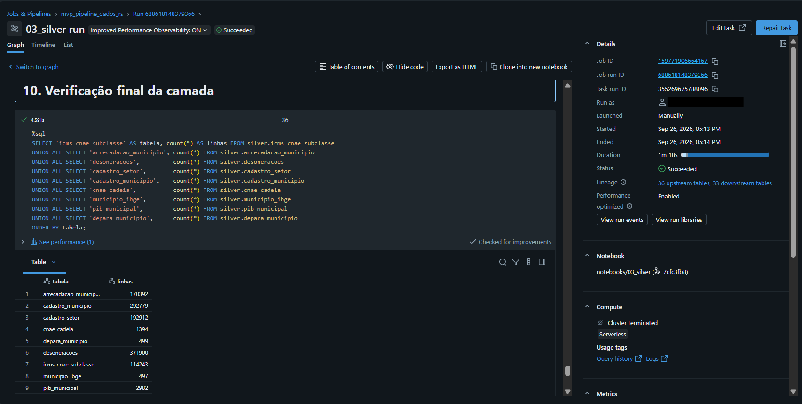

### 4.3 Construção da Gold — [`05_gold`](notebooks/05_gold.ipynb)

As dimensões são construídas a partir da Silver (dimensão de CNAE com códigos de quatro fontes; dimensão de
município com IBGE, COREDE do cadastro e código da SEFAZ). Os fatos copiam o grão da Silver e recebem a chave
`sk_tempo` ou o código IBGE do de-para. O notebook termina com 23 **invariantes de negócio** gravadas em
`gold.relatorio_invariantes` (seção 5.4).

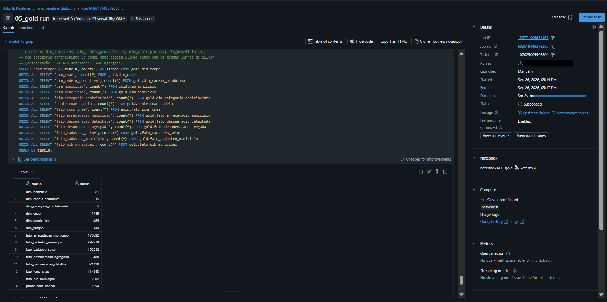

### 4.4 Orquestração

O Job `mvp_pipeline_dados_rs` executa os notebooks diretamente deste repositório (Git provider, branch `main`). A definição está versionada em
[`jobs/mvp_pipeline_dados_rs.json`](jobs/mvp_pipeline_dados_rs.json).
O `04_qualidade_dados` roda em paralelo ao `05_gold`: os dois dependem apenas da Silver. O `01_teste_acesso_fontes` fica fora do Job, por ser diagnóstico de coleta.

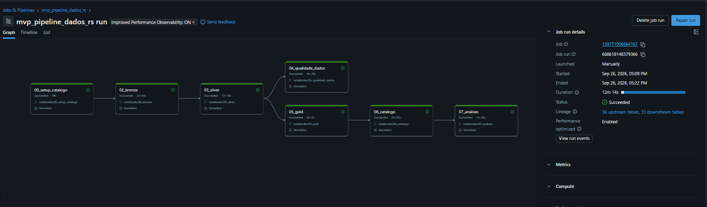

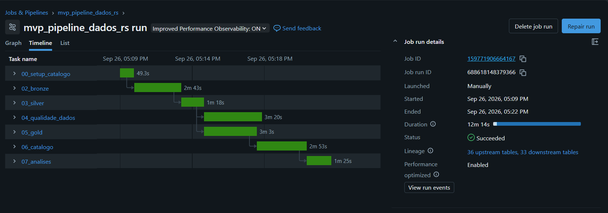

O histórico Delta de cada tabela registra o `jobRunId` da execução que a gravou, o que distingue as versões
produzidas pelo Job das gravadas em execução manual:

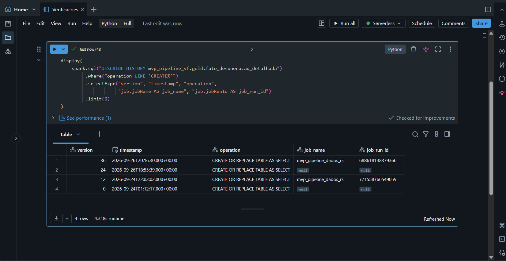

---

## 5. Qualidade de Dados

### 5.1 Método

O notebook [`04_qualidade_dados`](notebooks/04_qualidade_dados.ipynb) mede a Silver em cinco dimensões, mais a reconciliação entre camadas, e grava cada resultado em `silver.relatorio_qualidade` (dimensão,
tabela, verificação, valor medido, critério esperado, situação e observação).

| Situação | Significado |
| --- | --- |
| `OK` | Critério atendido |
| `TRATADO` | Limitação conhecida, medida e com decisão registrada |
| `ATENÇÃO` | Fora do critério; exige investigação |

Resultado: **62 verificações — 49 `OK`, 13 `TRATADO`, nenhuma `ATENÇÃO`**.

| Dimensão | Verificações | Exemplos |
| --- | ---: | --- |
| Completude | 16 | nulos em valores e chaves; ICMS sem CNAE; anos incompletos; fluxos do cadastro por município; categoria nula |
| Consistência | 14 | tamanho de código; faixa de mês; sinal dos valores; domínio de categorias e tipos; igualdade entre as duas séries de ICMS; coerência PIB/população/per capita |
| Unicidade | 9 | duplicatas no grão declarado de cada tabela; chave da dimensão de benefício |
| Acurácia | 8 | crédito presumido e total estadual contra valores publicados; PIB e população contra referências; cobertura das cadeias |
| Outliers | 2 | razão máximo/mediana do ICMS por subclasse; concentração das dez maiores subclasses |
| Reconciliação | 13 | linhas e soma das medidas, Bronze × Silver, em sete tabelas |

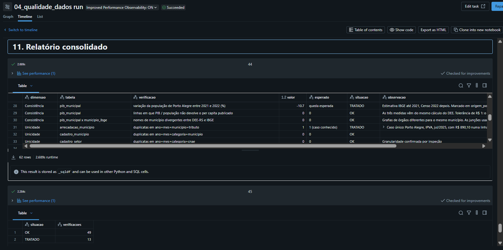

### 5.2 Problemas detectados e tratamento

| Problema | Natureza | Tratamento |
| --- | --- | --- |
| Encodings mistos na mesma fonte | Sintático | Detecção por arquivo na Bronze |
| Decimal com vírgula; ponto de milhar em ano, código e CNAE | Sintático | Conversão na Silver; reconciliação com a Bronze até o centavo |
| Acentos alternados em tipo e finalidade das desonerações | Sintático | Normalização sem acento na Silver |
| 168 códigos CNAE sem zero à esquerda na planilha do Sebrae; hierarquia CNAE sem zero nas desonerações | Sintático | `lpad` na Silver |
| Quatro grafias de município divergentes entre SEFAZ e IBGE | Sintático | Chave de nome normalizada no de-para |
| Duas versões da CNAE e duas categorias residuais sob `0000000` | Característica da fonte | Versão e nome no grão do fato de ICMS; coluna `sem_cnae` |
| 4,16% do ICMS sem CNAE atribuído | Limitação da fonte | Mantido; declarado como teto do recorte setorial (95,8% do ICMS disponível para cadeias) |
| 16 linhas de ICMS negativo (−R$ 10,4 mi, 0,002% do total) | Legítimo: restituição e compensação | Mantidas; excluí-las superestimaria a arrecadação |
| Porto Alegre, IPVA, jul/2025: linha "SEM COREDE" de R$ 890,10 | Inconsistência da fonte | Mantida; na Gold o COREDE vem da dimensão de município |
| 67 grupos repetidos no grão das desonerações (subclasses 4631100 e 4712100) | Grão mais fino que as colunas publicadas | Mantidos; agregações somam, o que a aderência do crédito presumido ao valor publicado confirma |
| Cinco linhas detalhadas de desoneração sem CNAE (2016–2017) | Limitação da fonte | Mantidas; somam no total, fora do recorte setorial |
| Baixas do MEI acumuladas, contrariando o dicionário da fonte; MEI publicado só desde set/2024 | Semântico, sem correção | MEI fora das análises (`entra_analise = false`) |
| Fluxos do cadastro por município incompletos a partir de 2021 (aberturas de 2023 = 2,9% das do cadastro por setor) | Semântico, sem correção | Análises territoriais usam variação de estoque |
| 46 linhas do cadastro por município sem categoria | Limitação da fonte | Mantidas; fora de todo recorte por categoria |
| Exclusão de cerca de 14,8 mil estabelecimentos do Simples Nacional em jan/2024, sem registro no fluxo | Evento regulatório | Ressalva na dimensão de categoria; leitura por estoque |
| Quebra da série de população em 2022 (Censo) | Característica da fonte | `origem_populacao`; P5 restrita a 2018–2021 |
| Ano de 2026 incompleto em todas as séries mensais | Característica da fonte | `ano_completo` na `dim_tempo` |
| Benefícios da calamidade de 2024 | Evento extraordinário | Marcador `evento_extraordinario`; análises com e sem os dispositivos |
| Composição do total estadual de desonerações ambígua na nota técnica | Regra de negócio | Regra do quadro-resumo validada por medição (R$ 15,055 bi contra R$ 15 bi divulgados em 2023); atributo `integra_total_estadual` |

### 5.3 Aferições contra valores publicados

| Verificação | Base | Publicado | Divergência |
| --- | ---: | ---: | ---: |
| Crédito presumido, 2024 | R$ 6.347,82 mi | R$ 6.348,08 mi | 0,004% |
| Crédito presumido, 2025 | R$ 7.216,71 mi | R$ 7.218,12 mi | 0,02% |
| Total estadual de desonerações, 2023 | R$ 15,055 bi | R$ 15 bi (arredondado) | compatível |
| PIB do RS, 2023 | R$ 650,1 bi | aprox. R$ 650 bi | aderente |
| População de Porto Alegre, 2022 | 1.332.569 | 1.332.570 (Censo) | 1 pessoa |

O crédito presumido é a única modalidade declarada pelo próprio contribuinte. Por isso foi escolhido para a aferição: se o valor bate com o publicado, download, encoding, conversão decimal, tipagem e filtro estão corretos. As demais conferências do pipeline
(verificações internas, reconciliação Bronze × Silver e igualdade entre as duas séries de ICMS) se apoiam nos
próprios dados; só as aferições desta tabela são independentes dele. Um erro já presente no arquivo publicado pela SEFAZ passaria por todas essas verificações; só a comparação com valores publicados em outros documentos poderia detectá-lo.

### 5.4 Invariantes da Gold

| Invariante | Quantidade | Esperado | Resultado |
| --- | ---: | --- | --- |
| Reconciliação Silver × Gold (valor e linhas dos sete fatos) | 5 | 0 | 0 |
| Total estadual de 2023 | 1 | aprox. 15 | 15,055 |
| Unicidade das chaves de dimensão | 4 | 0 | 0 |
| Integridade referencial (fato × dimensão) | 11 | 0 | 0 |
| Coerência PIB / população / per capita | 1 | 0 | 0 |
| Ponte N:N (excedente da soma por cadeia sobre o ICMS) | 1 | maior que 0 | 3,02% |

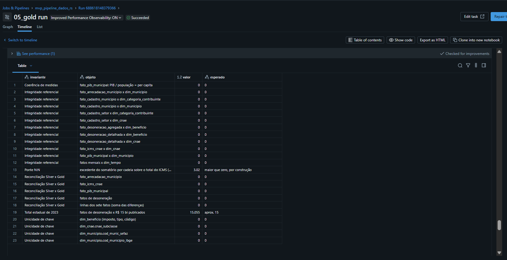

---

## 6. Análise de Dados

As consultas estão em [`07_analises`](notebooks/07_analises.ipynb), uma por célula, sobre a Gold. Os gráficos
são desenhados em Python a partir do resultado da célula SQL anterior, sem repetir consulta.


### P1 — Quais cadeias produtivas mais cresceram em arrecadação de ICMS?

**Medida.** Crescimento relativo: variação da participação da cadeia no ICMS total do RS. Como cadeia e Estado
carregam a mesma inflação, a medida é neutra em relação ao nível geral de preços. O ICMS do RS passou de
R$ 36,21 bi em 2020 para R$ 53,83 bi em 2025 (+48,7% nominal). A comparação foi repetida com base em 2021,
porque 2020 teve arrecadação deprimida pela pandemia.

**Resposta.** Entre as cadeias sem ressalva, Moda, Alimentos e Bebidas e Móveis cresceram acima do ICMS do
Estado nas duas bases. Alimentos e Bebidas teve o maior ganho de peso: de 20,5% para 23,9% do ICMS.
Metalmecânico e Casa e Construção cresceram acima do Estado apenas contra 2020; contra 2021, perdem
participação. Leite e Grão Integrados perdem peso nas duas bases.

| Cadeia | Relativo 2020–2025 | Relativo 2021–2025 | Participação 2025 | Ressalva |
| --- | ---: | ---: | ---: | --- |
| Moda | +32,7% | +40,4% | 4,39% | — |
| Alimentos e Bebidas | +16,7% | +28,2% | 23,92% | — |
| Móveis | +12,5% | +14,9% | 2,48% | — |
| Casa e Construção | +4,7% | −12,1% | 4,68% | — |
| Metalmecânico | +1,0% | −10,2% | 10,54% | — |
| Grão Integrados | −30,4% | −23,0% | 0,36% | — |
| Turismo | +186,8% | +194,8% | 0,77% | cobertura 62% |
| Vitivinicultura | +19,5% | +32,1% | 0,52% | < 5 subclasses |
| Pecuária | +5,4% | +23,1% | 1,15% | cobertura 69% |
| Saúde | −6,2% | −5,4% | 0,94% | cobertura 34% |
| Leite | −37,8% | −22,9% | 0,55% | < 5 subclasses |

Apicultura, Olivicultura e Horticultura têm, cada uma, menos de 0,1% do ICMS de 2025 e ressalva; ficam fora
da leitura.

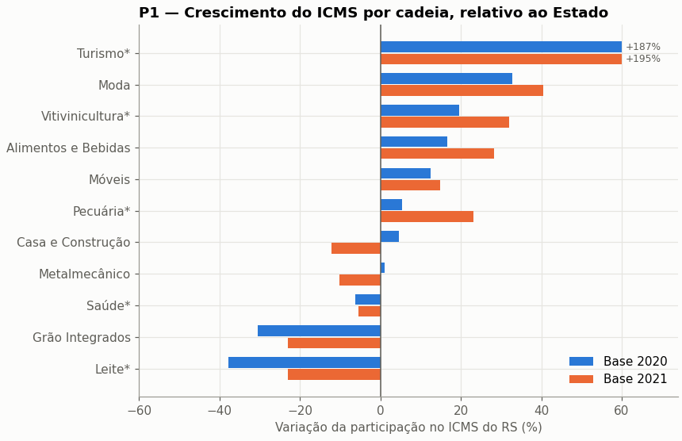

**Discussão.** A ordenação é estável entre as duas bases (Spearman 0,96), mas o sinal muda em Metalmecânico e
Casa e Construção: o ganho de ambas desde 2020 se explica pela base deprimida de 2020: contra 2021, as duas perdem participação. Turismo lidera a partir
de uma base de 0,27% do ICMS e com cobertura parcial, ou seja, o ICMS mede só a parte comercial de uma cadeia
majoritariamente de serviços, tributados pelo ISS. A arrecadação é concentrada: as dez maiores subclasses
respondem por 41,7% do ICMS de 2024 (40,9% sem o código residual), o que torna a participação, e não a média, a
medida adequada. A medida não controla preços relativos nem mudanças na base do ICMS, como a limitação das
alíquotas de combustíveis, energia e telecomunicações pela LC 194/2022. A migração da CNAE 1.1 para a 2.0 em
2025 não afeta a ordenação: 99,7% do ICMS registrado na versão 1.1 estava no código residual, fora de qualquer
cadeia.

### P2 — Quais cadeias e COREDEs concentram as desonerações de ICMS, e qual a razão desoneração/arrecadação?

**Recorte.** ICMS, nível detalhado, finalidade econômica e integrante do total estadual: R$ 35,24 bi de 2020 a
2025. O não estorno do crédito fica fora, porque não integra o total do Estado e parte dele decorre de
convênios, não de incentivo setorial. O recorte dobrou no período (de R$ 3,85 bi para R$ 7,72 bi), enquanto o
ICMS cresceu 48,7%; a razão sobre o ICMS subiu de 10,6% para 14,3%. O crédito presumido responde por 88% do
recorte.

**Resposta.** Alimentos e Bebidas concentra 44,5% da desoneração setorial e Metalmecânico, 15,2%. No
território, cinco COREDEs concentram 60% do valor, mas a intensidade é maior no norte agroindustrial.

| Cadeia | Participação no recorte | Razão desoneração/ICMS |
| --- | ---: | ---: |
| Alimentos e Bebidas | 44,5% | 25,6% |
| Pecuária ¹ | 17,9% | 226,8% |
| Metalmecânico | 15,2% | 16,6% |
| Leite ² | 15,0% | 279,2% |
| Moda | 3,8% | 12,0% |
| Casa e Construção | 2,9% | 7,9% |
| Vitivinicultura ² | 1,6% | 44,7% |
| Móveis | 1,5% | 7,9% |

¹ Cobertura de ICMS de 69%. ² Menos de cinco subclasses. As participações não se somam (ponte N:N).

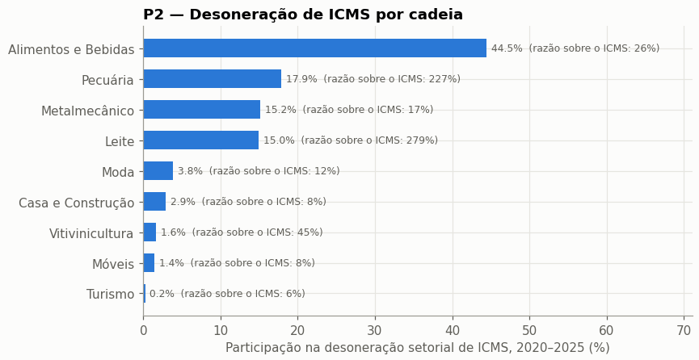

| COREDE | Participação | Acumulada | Razão desoneração/ICMS |
| --- | ---: | ---: | ---: |
| Metropolitano Delta do Jacuí | 18,5% | 18,5% | 10,4% |
| Serra | 14,5% | 33,0% | 21,1% |
| Vale do Rio dos Sinos | 10,7% | 43,6% | 5,1% |
| Produção | 8,9% | 52,5% | 35,2% |
| Vale do Taquari | 7,9% | 60,4% | 49,0% |

Maiores razões: Celeiro (75,7%), Médio Alto Uruguai (66,1%), Noroeste Colonial (64,4%), Nordeste (61,6%), Rio
da Várzea (57,4%) e Alto Jacuí (54,6%).

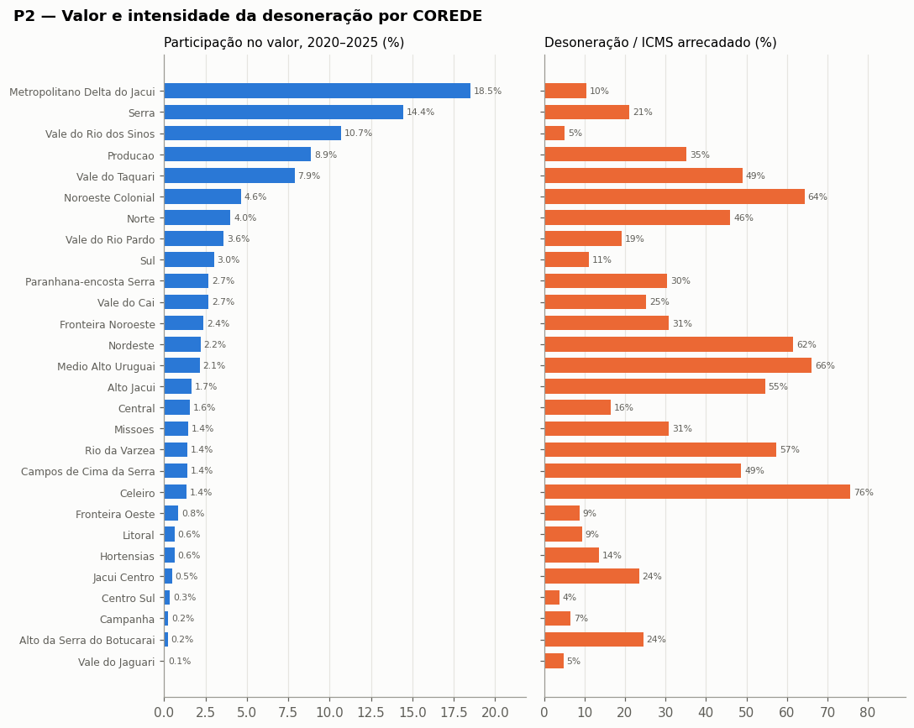

**Discussão.** Em valor, a desoneração acompanha o tamanho da economia regional. Em intensidade, o padrão se
inverte: nos COREDEs agroindustriais do norte, o valor renunciado chega a 55%–76% do ICMS arrecadado, contra
5%–10% na Região Metropolitana e no Vale do Sinos, cuja arrecadação inclui o refino de petróleo e as sedes de
grandes contribuintes. Pecuária e Leite têm razão acima de 100% porque a desoneração é valor bruto estimado e o ICMS é arrecadação líquida; em frigoríficos e laticínios o crédito presumido reduz o imposto
devido a quase zero. A sobreposição entre cadeias é o principal cuidado de leitura: Leite e Vitivinicultura
estão inteiramente contidas em Alimentos e Bebidas, e 70% da desoneração de Pecuária está em subclasses
compartilhadas com ela. Somadas, as cadeias contam R$ 10,36 bi duas vezes; sem dupla contagem, as 14 cadeias
cobrem 73,3% do recorte. Os dispositivos da calamidade somam R$ 90,6 mi em 2024 no recorte (1,3% do ano) e
não alteram a ordenação.

### P3 — Qual a participação de MPE nas empresas ativas por cadeia e COREDE, e como evoluiu a abertura?

**Universo.** Empresas de categoria Simples Nacional ou Geral; MPE = Simples Nacional. MEI e produtor rural
ficam fora: o MEI só é publicado desde set/2024, e o produtor rural é pessoa física.

**Resposta.** As MPE são 72,1% das empresas ativas em 2025 no cadastro por setor (74,1% no cadastro por
município). A participação é maior nas cadeias de bens de consumo e serviços: Turismo (83,3%), Moda (82,9%) e
Móveis (81,1%); e menor nas de produção primária e agroindústria: Leite (15,2%), Pecuária (23,1%) e Grão
Integrados (30,8%). Entre COREDEs, a variação é estreita: de 72,0% (Fronteira Noroeste) a 79,0% (Litoral). A
abertura de MPE é estável, em torno de 27 mil por ano desde 2021.

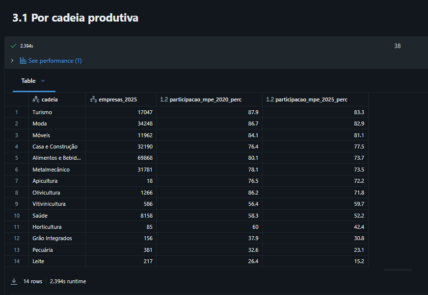

| Ano | Aberturas | Baixas | Saldo |
| --- | ---: | ---: | ---: |
| 2020 | 22.796 | 11.453 | +11.343 |
| 2021 | 26.917 | 11.237 | +15.680 |
| 2022 | 27.090 | 13.708 | +13.382 |
| 2023 | 27.839 | 14.919 | +12.920 |
| 2024 | 25.288 | 30.629 | −5.341 |
| 2025 | 26.148 | 21.651 | +4.497 |

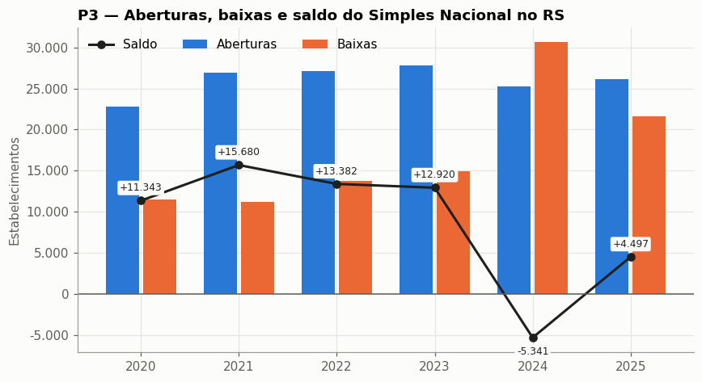

**Discussão.** A participação de MPE no Estado é estável de 2020 a 2023 e cai em 2025: 76,7%, 76,2% e 72,1% (2020, 2023 e 2025)
no cadastro por setor; 78,4%, 77,3% e 74,1% no cadastro por município. Em 01/01/2024 a Receita Federal excluiu
do Simples Nacional as empresas com débitos não regularizados: cerca de 14,8 mil estabelecimentos gaúchos
passaram para a categoria Geral sem registro de abertura ou baixa. Sozinha, essa transferência equivale a
cerca de 5 p.p. do universo de 2023, mais que a queda decorre da migração dessas empresas para a categoria Geral; o porte delas não mudou, e aparece em 12 das 14 cadeias e nos 28 COREDEs (de 1,0 a 8,0 p.p.). O saldo
negativo de 2024 vem das baixas: cerca de 12,7 mil em março e abril, três a quatro vezes o normal,
compatíveis com baixa de ofício de inscrições inativas.

### P4 — Cadeias mais desoneradas apresentaram maior saldo de aberturas menos encerramentos?

**Medida.** Intensidade de desoneração (razão entre a desoneração do recorte e o ICMS da cadeia, 2020–2025)
contra dinâmica empresarial: variação do estoque de empresas Simples Nacional e Geral (dez/2020–dez/2025) e
saldo de aberturas menos baixas (2021–2025) sobre o estoque de 2020. Correlação de Spearman, com posto médio
para empates.

**Resposta.** Não há associação significativa. A correlação entre intensidade de desoneração e dinâmica
empresarial das 14 cadeias é −0,25 para a variação do estoque e −0,17 para o saldo; com 14 cadeias, só valores
acima de 0,54 em módulo seriam significativos a 5%. Restrita às seis cadeias sem ressalva, a correlação é +0,49
nas duas medidas; com seis pontos, o limiar é 0,89.

| Cadeia | Intensidade de desoneração | Variação do estoque | Participação de MPE 2025 |
| --- | ---: | ---: | ---: |
| Leite ² | 279,2% | −10,3% | 15,2% |
| Pecuária ¹ | 226,8% | −11,4% | 23,1% |
| Alimentos e Bebidas | 25,6% | +4,9% | 73,7% |
| Metalmecânico | 16,6% | +16,2% | 73,5% |
| Moda | 12,0% | +1,2% | 82,9% |
| Saúde ¹ | 0,8% | +8,4% | 52,2% |

¹ Cobertura de ICMS abaixo de 70%. ² Menos de cinco subclasses.

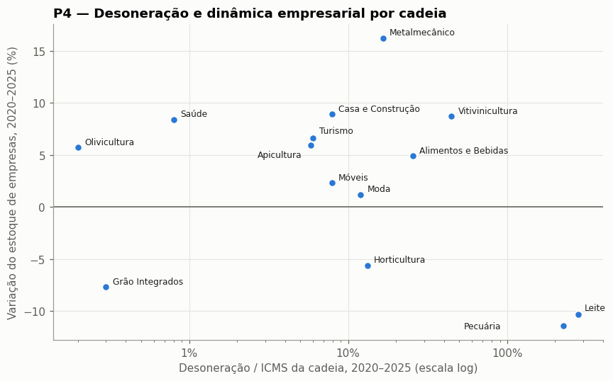

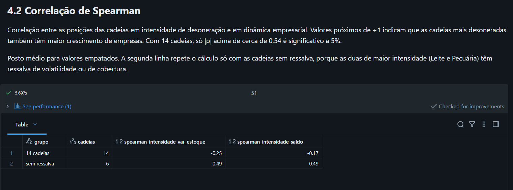

**Discussão.** As cadeias de maior renúncia relativa, Leite e Pecuária, reduziram o número de
estabelecimentos; a de maior crescimento, Metalmecânico, tem intensidade moderada; Saúde cresce sem
desoneração relevante. O crédito presumido só é acessível a empresas de categoria Geral, mas essa limitação não
explica o resultado sozinha: Leite e Pecuária têm estoque majoritariamente de categoria Geral e ainda assim
perderam estabelecimentos. Restrita às seis cadeias sem ressalva, grupo que exclui Leite e Pecuária, a correlação passa a +0,49, mas com seis pontos o valor não se distingue de zero.

### P5 — Municípios com maior crescimento do PIB per capita apresentam maior dinâmica de pequenos negócios?

**Medida.** Crescimento nominal do PIB per capita de 2018 a 2021, dentro da mesma base populacional
(estimativa do IBGE), contra a variação do estoque do Simples Nacional de dez/2018 a dez/2021. A medida
inicialmente prevista, taxa de abertura, foi substituída pelo estoque porque os fluxos do cadastro por município
são incompletos a partir de 2021. O período 2022–2023 fica fora pela quebra populacional do Censo 2022 e pela
exclusão do Simples Nacional em jan/2024, já refletida no estoque de dez/2023.

**Resposta.** Não há associação. Nos 497 municípios, a correlação de Spearman é −0,01.

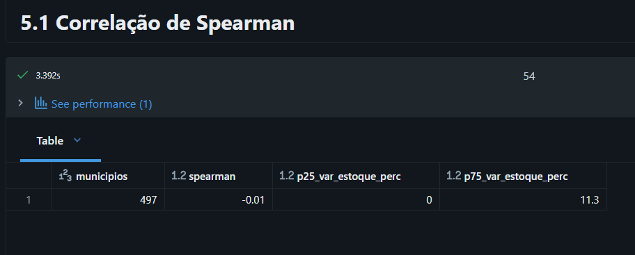

| Quintil de crescimento do PIB per capita | Mediana do crescimento nominal | Mediana da variação do estoque |
| ---: | ---: | ---: |
| 1 | 18,9% | +5,6% |
| 2 | 34,6% | +6,4% |
| 3 | 48,8% | +5,2% |
| 4 | 62,1% | +5,9% |
| 5 | 83,7% | +4,3% |

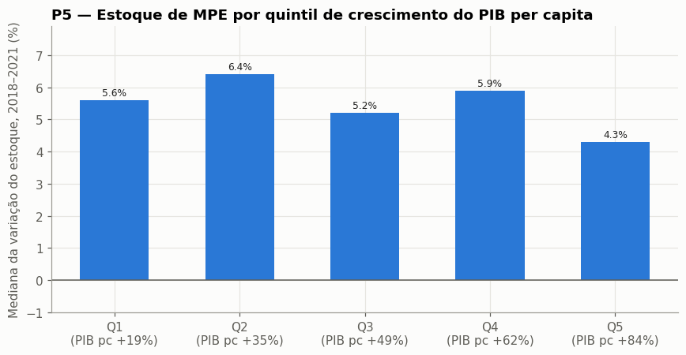

**Discussão.** O estoque do Simples Nacional cresce em todos os quintis, e a mediana não se ordena pelo
crescimento do PIB per capita, que vai de cerca de 19% a 84% entre os quintis. A dispersão entre municípios é
grande: metade tem variação entre 0,0% e +11,3%. Uma hipótese, não testada, é que o crescimento do PIB dos
municípios pequenos reflita a produção agropecuária, que gera valor sem abertura proporcional de empresas
urbanas.

### P6 — As cadeias produtivas mais desoneradas ampliaram suas exportações?

**Não respondida.** Para os fins do MVP, entendeu-se que a pergunta excedia o escopo do trabalho: exigiria uma
fonte adicional de comércio exterior e a correspondência entre NCM e CNAE para atribuir exportações às cadeias
(seção 1.6). A base de desonerações já indica a relevância do tema: o não estorno do crédito ligado às
exportações é o maior bloco do nível detalhado (R$ 11,6 bi em 2023), concentrado em óleos vegetais, soja e fumo,
mas é de competência federal e fica fora do recorte setorial. A pergunta permanece como oportunidade de análise
futura.

### Discussão geral

O problema de negócio era verificar se as cadeias produtivas e as regiões do RS que recebem mais incentivos
fiscais de ICMS apresentam maior crescimento econômico e maior dinâmica de pequenos negócios. Para as cadeias,
os dados não sustentam essa relação. Para as regiões, a pergunta foi respondida só em parte: a concentração
territorial da desoneração foi medida (P2), mas não cruzada com crescimento do PIB nem com dinâmica
empresarial por COREDE.

A desoneração setorial é concentrada em Alimentos e Bebidas (44,5%) e Metalmecânico (15,2%), mas a intensidade mais alta está em Leite e Pecuária, ambas com ressalva. Essa distribuição não acompanha o crescimento: Moda e Móveis ganham participação no ICMS com pouca desoneração, e Leite, a cadeia de maior intensidade, perde. No número de empresas, nenhuma associação foi significativa (P4), e o mesmo vale para PIB per capita e MPE nos municípios (P5). Em 2024, a exclusão do Simples Nacional e o pico de baixas têm a mesma ordem de grandeza da variação do estoque, o que impede ler esse ano como dinâmica empresarial

Implicação para a priorização de cadeias: a intensidade de incentivo fiscal não se mostrou indicador de dinamismo empresarial nesta amostra, e o apoio a pequenos negócios não pode pressupor que o incentivo estadual os alcance. As conclusões
são de associação, sobre valores nominais e com desoneração estimada; servem para comparar cadeias entre si, e os valores absolutos devem ser lidos com cautela, como recomenda a própria SEFAZ.

---

## 7. Autoavaliação

### 7.1 Atingimento dos objetivos

O pipeline foi construído de ponta a ponta na nuvem: coleta por script, três camadas persistidas em Delta,
modelo dimensional catalogado, verificação de qualidade e análise. Ele é executado por um Job a partir do
repositório. Cinco das seis perguntas foram respondidas, com alcances diferentes:

| Pergunta | Situação | Observação |
| --- | --- | --- |
| P1 | Respondida | Ordenação robusta ao ano de partida; medida nominal relativa, sem deflação |
| P2 | Respondida | Concentração por cadeia e COREDE; valores por CNAE e COREDE lidos como tendência, conforme a fonte |
| P3 | Respondida | Participação e fluxo medidos; MEI fora do universo por limitação da série |
| P4 | Respondida, com resultado inconclusivo | Sem associação significativa; o sinal muda quando a amostra se restringe às seis cadeias sem ressalva |
| P5 | Respondida com medida adaptada | Taxa de abertura substituída por variação do estoque; janela reduzida a 2018–2021 |
| P6 | Não respondida | Excedia o escopo do MVP; exigiria fonte de comércio exterior e correspondência NCM–CNAE |

A dimensão territorial do problema de negócio foi atendida só em parte: a desoneração por COREDE foi medida,
mas não cruzada com PIB nem com dinâmica empresarial por COREDE. A limitação estrutural mais relevante vem da
própria fonte: a desoneração setorial alcança apenas empresas de categoria Geral, o que impede medir o
incentivo recebido pelas MPE no mesmo nível de detalhe das demais perguntas.

### 7.2 Dificuldades

- **Acesso às fontes.** O servidor de CNPJ da Receita Federal recusou conexão a partir do Databricks, e os
  portais de governo exigiram contornar a cadeia de certificados ICP-Brasil. O DEE-RS e o Sebrae RS não
  oferecem URL estável, o que obrigou a carga manual de dois arquivos.
- **Formato heterogêneo na mesma fonte.** Encodings mistos, números no padrão brasileiro, ponto de milhar em
  colunas de código e acentuação alternada exigiram detecção por arquivo e padronização na Silver.
- **Semântica da fonte.** Os problemas mais relevantes não eram de formato, mas de significado: baixas do MEI
  acumuladas, fluxos do cadastro por município incompletos a partir de 2021, dois níveis de granularidade nas
  desonerações, composição ambígua do total estadual e a exclusão em massa do Simples Nacional em jan/2024.
  Nenhum deles aparece como erro de tipo e todos foram identificados por conciliação entre tabelas, leitura das
  notas técnicas ou análise.
- **Relação N:N entre CNAE e cadeia.** Somar cadeias duplica 3,02% do ICMS e cerca de 29% da desoneração,
  o que exigiu a ponte, a proibição de somas entre cadeias e o cálculo da cobertura sem dupla contagem.


### 7.3 Lições

A invariante de integridade entre o cadastro por município e a dimensão de categoria foi incluída na última revisão, apenas para confirmar o que se esperava. Ela encontrou 46 linhas sem categoria, que vêm da própria fonte, mostrando que uma verificação só tem valor quando pode falhar. Na mesma revisão, as verificações do notebook 04 foram reclassificadas, porque parte das checagens de consistência estava registrada como acurácia.

### 7.4 Trabalhos futuros

- **Cruzamento territorial completo**: desoneração por COREDE contra crescimento do PIB e dinâmica empresarial
  por COREDE, respondendo à parte regional do problema.
- **Granularidade CNAE × município**: integrar o cadastro CNPJ da Receita Federal, quando acessível, para
  atribuir atividade e município a cada empresa.
- **Valores reais**: deflacionar ICMS, desoneração e PIB (IPCA ou deflator implícito do PIB) para medir
  crescimento real.
- **MEI**: incluir a categoria quando a série publicada tiver anos suficientes.
- **Comércio exterior (P6)**: incorporar o Comex Stat e a correspondência NCM–CNAE para relacionar a
  desoneração de exportação ao desempenho exportador das cadeias.
- **Carga incremental e agendamento**: substituir a carga completa por incremental nas séries mensais e agendar
  o Job conforme a atualização das fontes.
- **Qualidade como restrição**: migrar as verificações do relatório para *expectations* do Lakeflow
  Declarative Pipelines, interrompendo a carga quando um critério falhar.
- **Consumo**: painel sobre a Gold para acompanhamento das cadeias prioritárias.

---

## 8. Estrutura do repositório e reprodução

```
mvp-pipeline-dados-rs/
├── notebooks/        # 00 a 07, na ordem de execução
├── jobs/             # a definição serve de referência para recriar o Job pela interface ou pela API
├── docs/img/         # evidências de execução
└── README.md
```

Para reproduzir no Databricks:

1. Conectar o repositório como pasta Git (*Git folder*).
2. Executar `00_setup_catalogo` para criar catálogo, schemas e volume.
3. Carregar no volume `bronze.arquivos_brutos` os dois arquivos sem URL estável:
   `deers/19092428-pib-municipios-rs-2002-2023-serie-historica(dados).csv` (DEE-RS) e
   `cadeias/classificacao_cnae_cadeias_v2.xlsx` (Sebrae RS).
4. Criar o Job a partir de `jobs/mvp_pipeline_dados_rs.json` e executá-lo.

---

## 9. Referências

- Receita Estadual do RS. *Portal Receita Dados*. https://receitadados.sefaz.rs.gov.br/
- Receita Estadual do RS. *Desonerações fiscais: nota técnica metodológica*, versão de 11/09/2025.
- Receita Estadual do RS. *Desonerações Fiscais — Conceito*.
- Receita Estadual do RS. *Nota técnica especial: benefícios concedidos após a calamidade de 2024*.
- Receita Estadual do RS. *Acompanhamento do crédito presumido, 2024–2025*.
- IBGE. *API de Localidades*. https://servicodados.ibge.gov.br/api/docs/localidades
- DEE-RS. *PIB dos municípios do RS, série histórica 2002–2023*. https://dee.rs.gov.br/pib-municipal
- Sebrae RS. *Classificação de CNAEs por cadeia produtiva*, V2, 2026 (documento institucional).
- Databricks. *Unity Catalog*, *Delta Lake* e *Lakeflow Jobs* — documentação oficial.
